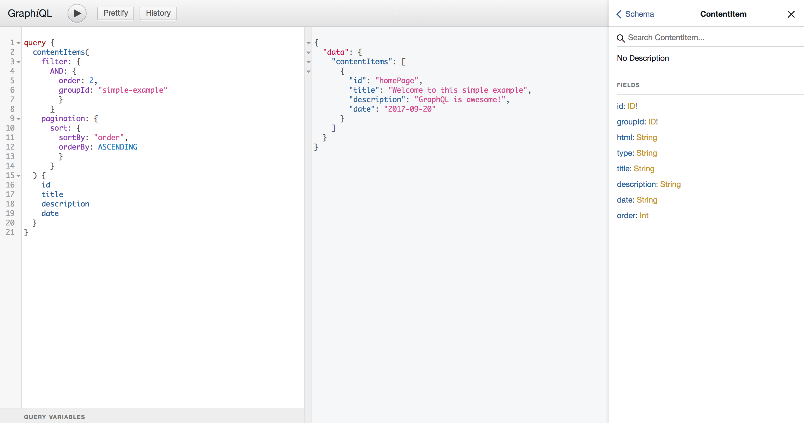

# Nuxt Markdown GraphQL



> Markdown to GraphQL module for Nuxt.js

## Setup

- Install `nuxt-markdown-graphql` using `yarn add nuxt-markdown-graphql` or `npm install nuxt-markdown-graphql`
- Add `nuxt-markdown-graphql` to `modules` section of `nuxt.config.js`

```js
{
  modules: [
    // Simple usage
    'nuxt-markdown-graphql',

    // With options
    ['nuxt-markdown-graphql', { /* module options */ }],
 ]
}
```

## API

Current options only for custom markdown file directory, you extend contentRoot path like this:

```js
{
  modules: [
    // With options
    [
      'nuxt-markdown-graphql', {
        contentRoot: __dirname + '/foo'
      }
    ]
 ]
}
```

## Development

- Clone this repository
- Install dependencies using `yarn install` or `npm install`
- Start development server using `npm run dev`

## License

[MIT License](./LICENSE)

Copyright (c) Muhibbudin Suretno <muhibbudinsuretno1@gmail.com>
